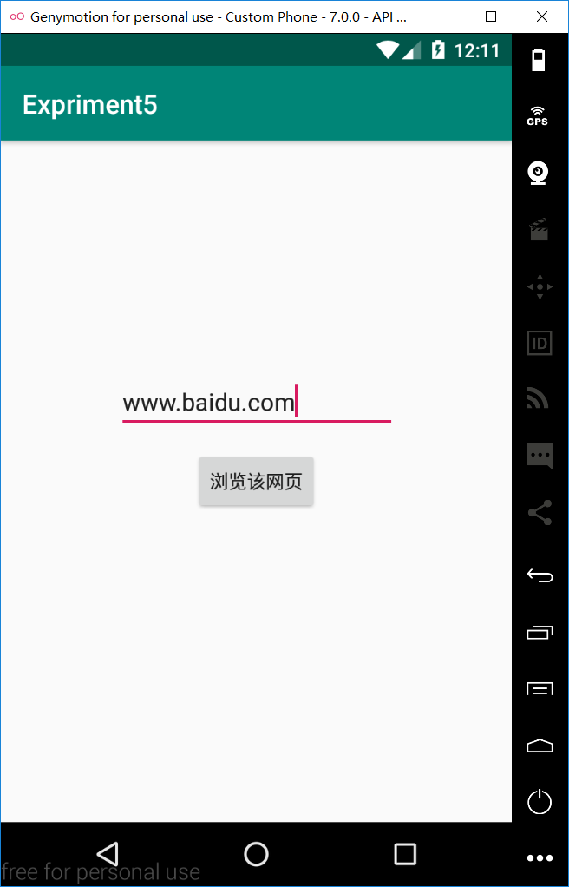
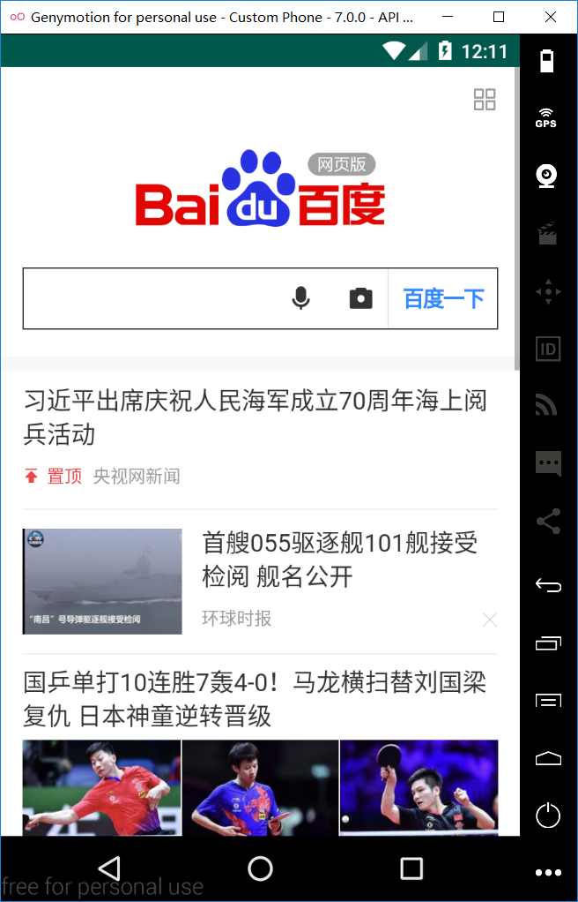

# Expriment5
安卓移动开发实验5 - Intent（WebView)

程序界面：


## 安卓模拟器无内置浏览器 故无出现选择项


### 关键代码1
```
package com.example.tired.expriment5;

import android.content.Intent;
import android.net.Uri;
import android.support.v7.app.AppCompatActivity;
import android.os.Bundle;
import android.view.View;
import android.widget.Button;
import android.widget.EditText;
import android.widget.TextView;

public class MainActivity extends AppCompatActivity {

    private Button b1;
    private EditText t1;
    @Override
    protected void onCreate(Bundle savedInstanceState) {
        super.onCreate(savedInstanceState);
        setContentView(R.layout.activity_main);
        t1 = findViewById(R.id.editText);
        b1 = findViewById(R.id.button);

        b1.setOnClickListener(new View.OnClickListener(){
            @Override
            public void onClick(View v){
                String url= t1.getText().toString();
                Intent intent = new Intent(MainActivity.this,SecondActivity.class);
                intent.putExtra("url",url);
                startActivity(intent);
            }
        });
    }
}
```
### 关键代码2
```
package com.example.tired.expriment5;

import android.app.Activity;
import android.content.Intent;
import android.net.Uri;
import android.support.v7.app.AppCompatActivity;
import android.os.Bundle;
import android.view.Window;
import android.webkit.WebView;
import android.webkit.WebViewClient;

public class SecondActivity extends Activity {

    private WebView webview;
    @Override
    protected void onCreate(Bundle savedInstanceState) {
        super.onCreate(savedInstanceState);
        setContentView(R.layout.activity_second);
        Intent intent = getIntent();
        String url =intent.getStringExtra("url");
        webview = new WebView(this);
        webview.setWebViewClient(new WebViewClient(){
            @Override
            public boolean shouldOverrideUrlLoading(WebView view, String url) {
                view.loadUrl(url);
                return true;
            }
        });
        webview.getSettings().setJavaScriptEnabled(true);  //设置WebView属性,运行执行js脚本
        webview.loadUrl("https://"+url+"/");          //调用loadUrl方法为WebView加入链接
        webview.setWebViewClient(new WebViewClient(){    //
            @Override
            public boolean shouldOverrideUrlLoading(WebView view, String url) {

                try{
                    if(url.startsWith("baiduboxlite://")||url.startsWith("https://")||url.startsWith("baiduboxapp://")){
                        Intent intent = new Intent(Intent.ACTION_VIEW, Uri.parse(url));
                        startActivity(intent);
                        return true;
                    }
                }catch (Exception e){
                    return false;
                }
                view.loadUrl(url);
                return true;
            }
        });
        setContentView(webview);
    }
}

```
